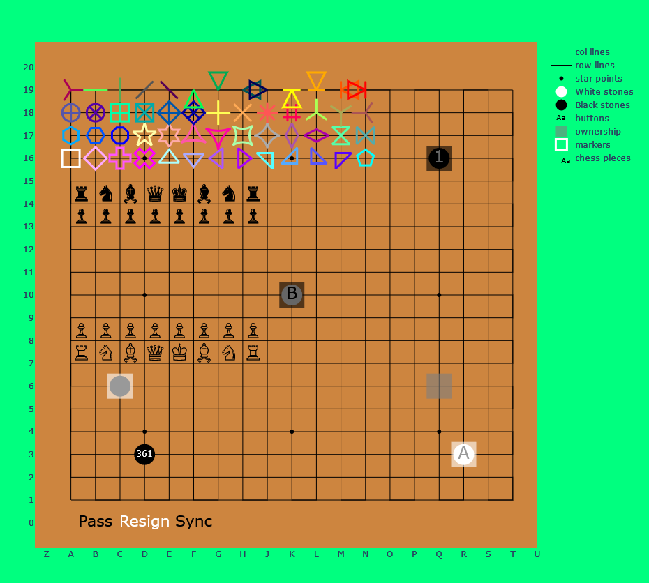
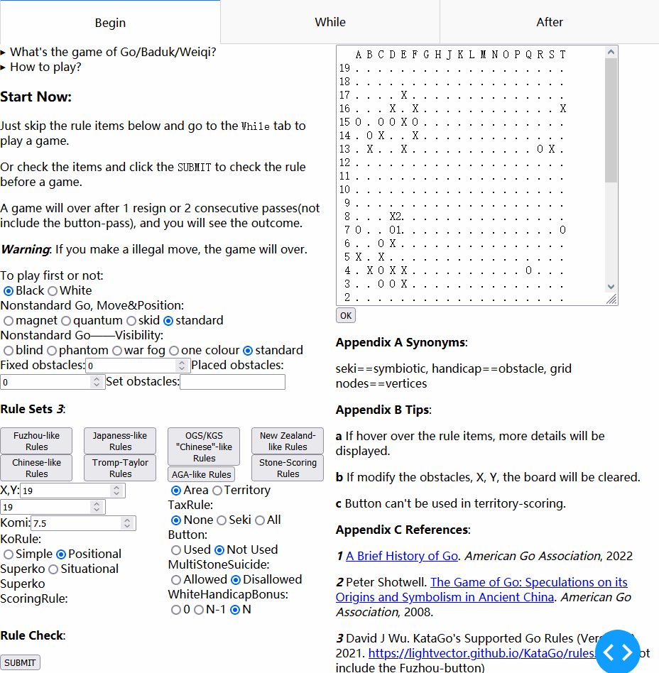

未来 /\ , \\/ 当前


## 关于

**注意：仍处于上古[时期](doc/versions.md#001-just-work)，代码很混沌。**

> README同时具有[简体中文](./README_CN.md)、[English](./README.md)两版，仓库同时在[Gihub](https://github.com/HackYardo/VastGo)和[Gitee](https://gitee.com/vastgo/VastGo)上。此仓库与[围棋](https://www.usgo.org/learn-play)、[围棋文本协议(GTP)](http://www.lysator.liu.se/~gunnar/gtp/)、[智能游戏格式(.sgf)](https://www.red-bean.com/sgf/)、[卡塔围棋](https://katagotraining.org/)、[莉拉零](https://zero.sjeng.org/)、[牛羚围棋](https://www.gnu.org/software/gnugo/)、[Julia](https://julialang.org/)、[PlotlyJS.jl](https://plotly.com/julia/)、[Dash.jl](https://dash-julia.plotly.com/)、[Markdown](https://commonmark.org/)、[可放缩向量图(.svg)](https://developer.mozilla.org/en-US/docs/Web/SVG)、[正则表达式](https://ryanstutorials.net/linuxtutorial/grep.php)等有关……

VastGo是
- 一个多平台的围棋GUI，能运行于Windows、Linux、Android，或许FreeBSD、MacOS、IOS、HarmonyOS也行。 
- 以Dash.jl、PlotlyJS.jl、JSON3.jl和现代或古典的GTP引擎为基础。
- 以100%的julia写就，采用MIT[许可](#许可)。

设计：
```
            DATA
Players <<<======>>> components
             ||          /\
            c||b         ||
            a||a        c||b
            l||c        a||a
            l||k        l||c
             ||s        l||k
             ||          ||s
             \/          ||
          functions <<<======>>> Bots
                        DATA
```

点子：
- **有趣**：不标准的围棋，*击败AI就是现在*
- **绿色**：使用对弈时数据来进行首次复盘，*更少过度计算更少CO₂* 
- **简单**：不知围棋何物，使用GTP命令`showboard`，*更少代码更少措手不及*
- **实用**：游戏树-分数曲线、三维形势、样条线型、 f'(x)、f"(x)，*丰富强大的绘图*
- **兼容**：用SBKV表示赢率、用OGSC表示目差，*与Sabaki和Ogatak相同的SGF* 

## 功能
- [一些不标准的玩法及其随意混合](doc/features.md#nonstandard-go)
- [愿望列表](doc/features.md)
- [路线图](doc/versions.md)

*小心：避免与已有的网站、软件重复，如[boardspace](https://www.boardspace.net/english/index.shtml)、[kahv](https://go.kahv.io/)、[littlegolem](https://www.littlegolem.net/jsp/main/)，而且能用相应的bot或AI来对弈和分析*

## 用法

<details>
  <summary>当前速览</summary>

软件 | 电脑 | 手机
--- | --- | ---
julia | >= 1.6.7 | 1.6.7 - 1.7.2
KataGo | **PASS** | **PASS**
Leela-Zero | *fail* | *fail*
GNU Go | *fail* | *fail*

模式 | 棋盘尺寸 | 状态信息
--- | --- | --- 
Blind Go | **2² - 19²** | **PASS** 
One Color Go | **2² - 19²** | **PASS** 
Phantom Go | **2² - 19²** | **PASS** 
Magnet Go | *19²* | *captures*, *move history*

</details>

<details>
	<summary>硬软件需求</summary>
  
**硬件：**
- 剩余磁盘空间 >= 2GB
- 总共内存容量 >= 8GB

**Julia、包和本仓库：**
1. 下载[julia](https://julialang.org/)并添加到路径
2. 在终端cmd/shell/terminal里运行julia，即进入julia REPL模式
```shell
shell> julia 
```  
3. 进入julia Pkg REPL模式
```shell
julia> ]
```
4. 安装包
```julia
(@v1.8) pkg> add Dash PlotlyJS JSON3 PackageCompiler LinearAlgebra TOML PlotlyBase
```
5. 下载本仓库

**卡塔围棋、莉拉零、牛羚围棋：**
（如果你的设备上没有的话……）
- 卡塔围棋：下载其[引擎](https://github.com/lightvector/KataGo/releases/)和一个[网络](https://katagotraining.org/networks)
- Linux(Debian/Ubuntu): 
  1. `sudo apt update -y`
  2. `sudo apt install leela-zero gnugo`
  3. 下载莉拉零的一个[网络](https://zero.sjeng.org/)

</details>

<details>
  <summary>在终端里——运行src/terminal.jl</summary>

1. 编辑`data/config.toml`，指示运行bot的**命令**、运行命令的**文件夹**, 以及**一个名字**来称呼它，例如
```toml
["ko"]
cmd = "./katago gtp -model elo9000.txt.gz"
dir = "../KataGoOpenCL/"
```
**注意：不要在莉拉零的命令中用`-q`，因为`showboard`会消失**

2. 带上bot的名字来运行`src/terminal.jl`，例如
```shell
shell> julia src/terminal.jl ko
```
3. 等到
```julia
[ Info: GTP ready 
```
4. 键入以下字符串，方可玩一局围棋
```shell
1 play B k10    # (id) command arguments
2 genmove W    # see GoTextProtocol for details
3 showboard
genmove B
5 play W c3
10 showboard
...
3 final_score
quit
```
</details>

<details>
  <summary>在浏览器中——运行app.jl</summary>

1. 运行`app.jl`
```shell
shell> julia app.jl
```
2. 等到
```julia
[ Info: Listening on: 0.0.0.0:8050
```
3. 打开一个(**仅一个**) 浏览器，在地址栏中键入`localhost:8050`后就可以玩了
4. 在终端里键入`exit`以退出程序
</details>

<details>
  <summary>在Android上</summary>

由于Android手机是arm而非x86-64，所以额外需要几个步骤：
1. 下载安装[Termux](https://github.com/termux/termux-app/)
2. 安装[ubuntu in termux](https://github.com/MFDGaming/ubuntu-in-termux)
3. 下载[julia for Generic Linux on ARM](https://julialang.org/downloads/platform/#linux_and_freebsd), **注意：不是x86-64，而是aarch64或armv7l**
4. 通过[9条命令](https://github.com/lightvector/KataGo/blob/master/Compiling.md#linux)，下载和编译卡塔围棋的引擎

之后就和在x86-64上是一样的了。
</details>

<details>
  <summary>卸载</summary>
  
**卸载julia、包和本仓库：**
- Julia不会在Git克隆文件夹之外安装任何事物，删除文件夹就是完全卸载。
- Julia的包默认安装在`~/.julia`，删除就是卸载。
- 删除本仓库。

**卸载卡塔围棋、莉拉零、牛羚围棋：**
（如果你的设备不需要了……）
1. `sudo apt remove leela-zero gnugo`
2. `sudo apt autoremove`
3. 删除卡塔围棋的引擎
4. 删除卡塔围棋和莉拉零的网络

</details>

## 问答
- 为什么创建？
  - C++有[q5Go](https://github.com/bernds/q5Go).
  - Java有[LizzieYzy](https://github.com/yzyray/lizzieyzy).
  - JavaScript有[Sabaki](https://sabaki.yichuanshen.de/)、[Lizgoban](https://github.com/kaorahi/lizgoban)、[Ogatak](https://github.com/rooklift/ogatak).
  - Python有[KaTrain](https://github.com/sanderland/katrain)、[BadukAI](https://aki65.github.io/).
  - 🚀🚀🚀 ***Julia也必须得有！*** 🚀🚀🚀
- 为什么这么慢？
  - Julia的编译器会适度优化代码，这花些时间。
  - 通过[系统成像](https://julialang.github.io/PackageCompiler.jl/dev/examples/plots.html)可以重用编译工作。
- 为什么选择Julia语言？
  - [听听Evan Miller怎么说](https://www.evanmiller.org/why-im-betting-on-julia.html) 
- 为什么选择Plotly(JS) Dash框架？
  - 有更多的[交互式](https://docs.juliaplots.org/latest/backends/)功能。

## 许可
[许可](./LICENSE.md) 
[第三方](./THIRDPARTY.md)

## 贡献
```julia
if 源码 in 贡献
    @goto Issues
else
    @goto 评论
end

@label Issues
    browser("https://gitee.com/vastgo/VastGo/issues")
@label 评论
    browser("https://gitee.com/vastgo/VastGo")
```

## 文档
- [我的Markdown应试小抄](doc/Markdown.md)
- [GTP检查列表](doc/GTP-check-list.txt)
- [围棋、围棋应用、VastGo的结构](doc/structure.md)
- 静态围棋棋盘状态矩阵
- [Julia风格应试小抄](doc/JuliaStyleCheatSheet.md)
