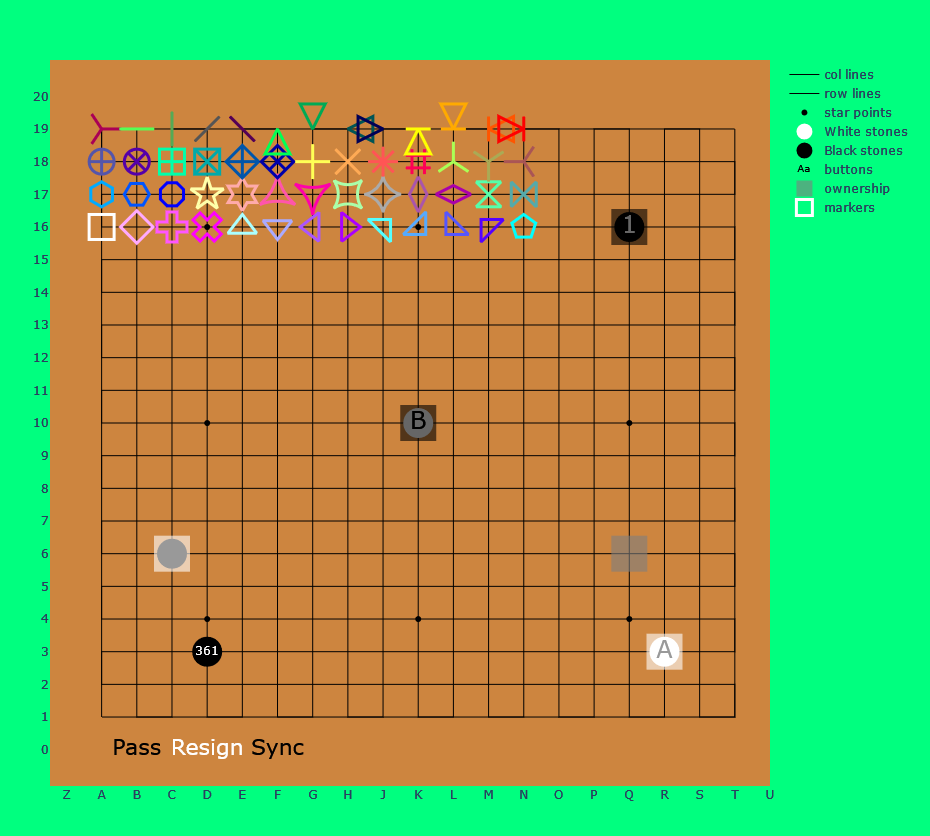
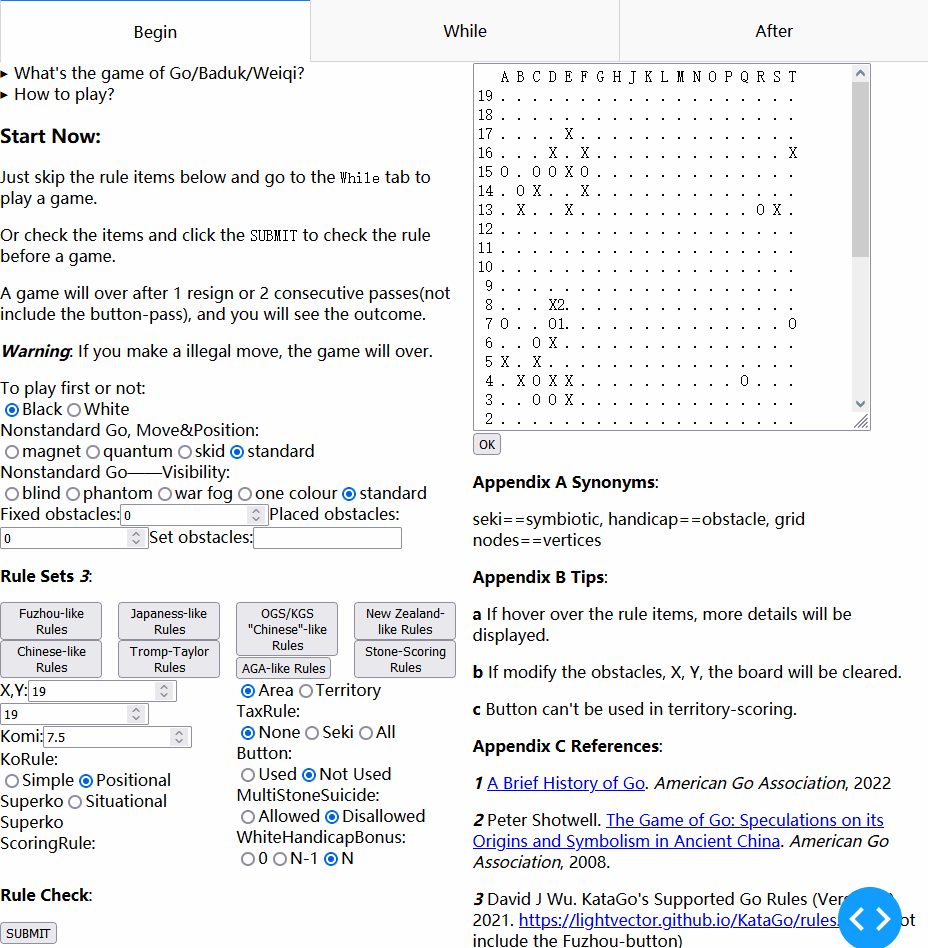

future

current 

## About

**Note: Still in the very early [stage](./versions.md#001-just-work), don't expect to be stable.**

> The repo is about the game of [Go/Baduk/Weiqi](https://www.usgo.org/learn-play), [GoTextProtocol(GTP)](http://www.lysator.liu.se/~gunnar/gtp/), [SmartGameFormat(.sgf)](https://www.red-bean.com/sgf/), [KataGo](https://katagotraining.org/), [Leela-Zero](https://zero.sjeng.org/), [GNU Go](https://www.gnu.org/software/gnugo/), [Julia](https://julialang.org/), [PlotlyJS.jl](https://plotly.com/julia/), [Dash.jl](https://dash-julia.plotly.com/), [Markdown](https://commonmark.org/), [ScalableVectorGraphics(.svg)](https://developer.mozilla.org/en-US/docs/Web/SVG), [Regular Expression](https://ryanstutorials.net/linuxtutorial/grep.php), etc.

VastGo is
- A multi-platform Go GUI that can run on Windows, Linux, Android and perhaps FreeBSD, MacOS, IOS, HarmonyOS. 
- Based on Dash.jl, PlotlyJS.jl, JSON.jl and modern or classic GTP engines.
- Written in pure julia and under the MIT [license](#license).

Design:
```
            DATA
Players <<<======>>> components
             ||          /\
            c||b         ||
            a||a        c||b
            l||c        a||a
            l||k        l||c
             ||s        l||k
             ||          ||s
             \/          ||
          functions <<<======>>> Bots
                        DATA
```

Ideas:

- **funny** | nonstandard Go, *BEAT AI RIGHT NOW*
- **green** | use playtime data to first review, *LESS EXCESSIVE COMPUTING LESS CO₂* 
- **simple** | don't know Go, use GTP command `showboard`, *LESS CODE LESS GOTCHA*
- **useful** | move-score-tree curve, 3D ownership, spline... line style, f'(x), f"(x), *RICH AND POWERFUL PLOT*
- **compatible** | SBKV for winrate and OGSC for score, *THE SAME SGF AS Sabaki AND Ogatak* 

## Why create this?
Look at the table:

Go GUI | Language
--- | ---
[Sabaki](https://sabaki.yichuanshen.de/) | JavaScript
[q5Go](https://github.com/bernds/q5Go) | C++
[Lizzie](https://github.com/featurecat/lizzie) | Java
[KaTrain](https://github.com/sanderland/katrain) | Python
[Lizgoban](https://github.com/kaorahi/lizgoban) | JavaScript
[BadukAI](https://aki65.github.io/) | Python
[Ogatak](https://github.com/rooklift/ogatak) | JavaScript

🚀🚀🚀 ***Julia must have one too!*** 🚀🚀🚀

## What's new here?
The [nonstandard Go](./features.md#nonstandard-go) and their free mixing.

## Features
[features](./features.md)
[versions](./versions.md)

***Be careful: avoid repetition to existing site/software, i.e. [boardspace](https://www.boardspace.net/english/index.shtml)/[kahv](https://go.kahv.io/)/[littlegolem](https://www.littlegolem.net/jsp/main/), and can be played/analyzed by corresponding bot/AI***

## Usage

<details>
	<summary>Hard/Software requirements</summary>
  
**Hardware:**
- Free HardDisk >= 2GB
- Total Memory >= 8GB

**Julia, packages and this repo:**
1. download and add [julia](https://julialang.org/) into path
2. run julia in cmd/shell/terminal and you will enter julia-REPL mode
```shell
cmd> julia 
```  
3. enter julia-pkg mode
```julia
julia> ]
```
4. install packages
```julia
(@v1.7) pkg> add Dash PlotlyJS JSON LinearAlgebra
```
5. download this repo

**KataGo, Leela-Zero, GNU Go:**
(If you don't have them yet...)
- KataGo: download its [engine](https://github.com/lightvector/KataGo/releases/) and a [network](https://katagotraining.org/networks)
- Linux(Debian/Ubuntu): 
  1. `sudo apt update -y`
  2. `sudo apt install leela-zero gnugo`
  3. download a [network](https://zero.sjeng.org/) of Leela-Zero

</details>

<details>
  <summary>in terminal——run terminal.jl</summary>

1. edit the first line of `terminal.jl` to indicate the command of running a bot
2. run `terminal.jl`
```shell
cmd> julia terminal.jl 
```
3. wait until
```shell
GTP ready 
```
4. type following strings to play a Go game
```shell
1 play B k10    # (id) command arguments
2 genmove W    # see GoTextProtocol for details
3 showboard
genmove B
5 play W c3
10 showboard
...
3 final_score
quit
```
</details>

<details>
  <summary>in browser——run kata_dash.jl</summary>

1. run `kata_dash.jl`
```shell
cmd> julia kata_dash.jl
```
2. wait until
```julia
[ Info: Listening on: 0.0.0.0:8050
```
3. open one(**only one**) browser and type `localhost:8050` in the address bar to play
4. type `exit` in terminal to exit the program
</details>

<details>
  <summary>on Android</summary>

Because Android phones are arm and not x86-64, you need more steps:
1. download and install [Termux](https://termux.com/)
2. install [ubuntu in termux](https://github.com/MFDGaming/ubuntu-in-termux)
3. download [julia for Generic Linux on ARM](https://julialang.org/downloads/platform/#linux_and_freebsd), **Note: instead of x86-64, use aarch64 or armv7l**

Now the same as on x86-64. **Note: there are no open KataGo ARM resource**
</details>

<details>
  <summary>uninstall</summary>
  
**uninstall julia, packages and this repo:**
- Julia does not install anything outside the directory it was cloned into. Julia can be completely uninstalled by deleting this directory. 
- Julia packages are installed in `~/.julia` by default, and can be uninstalled by deleting `~/.julia`.
- Delete this repo.

**uninstall KataGo, Leela-Zero, GNU Go:**
(If you don't use them anymore...)
- `sudo apt remove leela-zero gnugo`
- `sudo apt autoremove`
- delete KataGo's engine
- delete KataGo's and Leela-Zero's networks

</details>

## Q&A 
- Why so slow? 
  - Julia's compiler sort of optimises code, and it takes time.
  - Reuse the compiled work via [sysimage](https://julialang.github.io/PackageCompiler.jl/dev/examples/plots.html#examples-plots).
- Why Julia?
  - [Evan Miller](https://www.evanmiller.org/why-im-betting-on-julia.html) 
- Why Plotly(JS) Dash?
  - More [interactive](https://docs.juliaplots.org/latest/backends/) features than the others.

## LICENSE
[LICENSE](./LICENSE.md) 
[THIRDPARTY](./THIRDPARTY.md)

## Contribute
```julia
@label Issues = https://github.com/HackYardo/VastGo/issues
@label Discussions = https://github.com/HackYardo/VastGo/discussions

if sourceCode in contribution
  @goto Issues
else
  @goto Discussions
end
```

## Doc
- [my Markdown Cheat Sheet](./Markdown.md)
- [GTP Check list](./GTP-check-list.txt)
- [Structures of Go, Go APP, VastGo](./structure.md)
- static Go board state matrix
- [Julia Style Cheat Sheet](./JuliaStyleCheatSheet.md)
